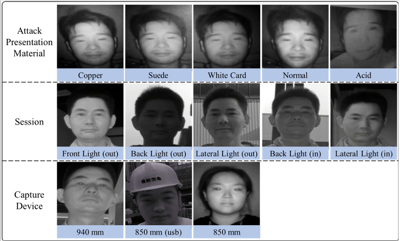

# Face Anti-spoofing in Near-Infrared Dataset

## introduction

We acquire image data in 3 Near-Infrared cameras:

1. 850\~nm Near-Infrared USB camera with a resolution of 640X480.

2. 850\~nm edge-device Near-Infrared camera with resolution of 640X480

3. 940\~nm edge-device Near-Infrared camera with resolution of 960X1280.

1032 people participated, two capture scenarios (indoor, outdoor), and three lighting directions (front light, lateral light, back light) are considered. We also randomly selected multiple lighting intensities for data collection. To increase the variety of attack materials, we select 7 different paper materials (*e.g.*, ordinary A4 paper, copper plate paper, sulfate paper, glossy paper, white cardboard, and suede) to print real face photos. The dataset consists of 4 different types of photos as they can be a threat to face recognition systems under near-infrared sensing. This dataset contains 380k images, including 237,780 training images and 145,047 testing samples.

## download link ()

The download Link: ****

download code: ****

## Citation

If the dataset is useful for your research, please cite：
