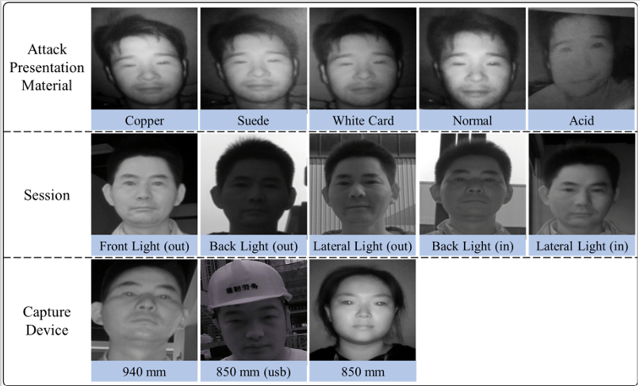

# Face Anti-spoofing in Near-Infrared Dataset

*Introduction*
We collect image data using three different Near-Infrared (NIR) cameras, with their detailed parameters listed below:

1. 850 nm Near-Infrared USB camera, with a resolution of 640×480;

2. 850 nm edge-device Near-Infrared camera, with a resolution of 640×480;

3. 940 nm edge-device Near-Infrared camera, with a resolution of 960×1280.

A total of 1032 participants were involved in the data collection. We considered two capture scenarios (indoor and outdoor) and three lighting directions (front light, lateral light, and back light), and randomly selected multiple lighting intensities to ensure the diversity of collected data. To enhance the variety of attack materials, we selected 7 different paper materials (e.g., ordinary A4 paper, copper plate paper, sulfate paper, glossy paper, white cardboard, and suede paper) to print real face photos for constructing spoofing samples.

The dataset includes 4 types of photos that may pose threats to face recognition systems under near-infrared sensing. In total, it contains approximately 380,000 images, consisting of 237,780 training images and 145,047 testing samples.

*Download Link*

The dataset is still being organized and will be published on ModelScope soon: wnwn22222/FASN

*Citation*
If the dataset is useful for your research, please cite the following article:

@article{li2024face,
  title={Face anti-spoofing with cross-stage relation enhancement and spoof material perception},
  author={Li, Daiyuan and Chen, Guo and Wu, Xixian and Yu, Zitong and Tan, Mingkui},
  journal={Neural Networks},
  volume={175},
  pages={106275},
  year={2024},
  publisher={Elsevier}
}

## download link 

Will in Publish in ModelScope:wnwn22222/FASN

## Citation
@article{li2024face,
  title={Face anti-spoofing with cross-stage relation enhancement and spoof material perception},
  author={Li, Daiyuan and Chen, Guo and Wu, Xixian and Yu, Zitong and Tan, Mingkui},
  journal={Neural Networks},
  volume={175},
  pages={106275},
  year={2024},
  publisher={Elsevier}
}

If the dataset is useful for your research, please cite：
